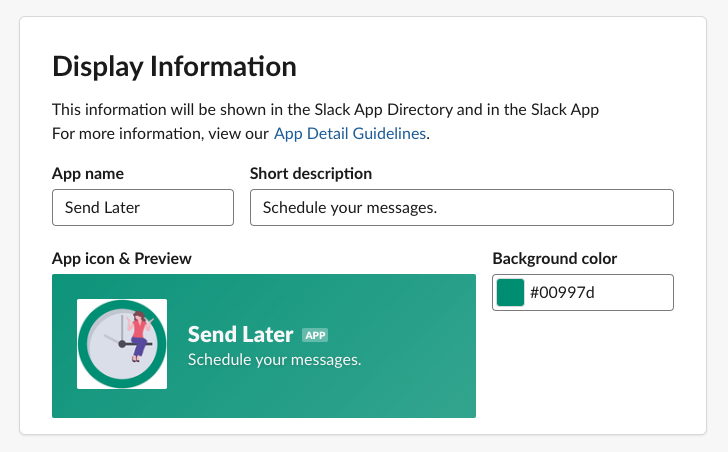
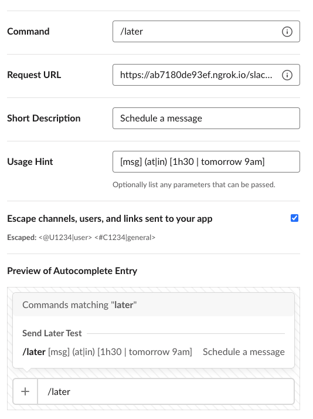

# Slack: Send Later 

A Slack app that enables you and your team to schedule your messages,
and to never bother your teammates in their free time while still not forgetting important stuff!

## Contributions

After following this setup, the installed Slack Bot will listen to the following commands:

- `/later <message> (at|in) <time>` in order to create a new scheduled message
  - Examples:
    - `/later Hey @john.doe! Are you free today? Need your help. at next Monday 9am`
    - `/later I got an issue, are you free? in 1 hour`
- `/later list` to list all your scheduled messages in a channel
- `/later help` prints a help message to inform you about the different commands
- `/later examples` prints out some examples on how to schedule messages

Of course, after scheduling a message, you will get a confirmation with the message text and
the scheduled timestamp. Also, you'll get the opportunity to cancel your scheduled message.

Same goes for listing all scheduled messages.

## Install the Slack App for Your Workspace

This application is the corresponding server for your Slack App which will listen to incoming events.

### Setup the Slack App

#### Create a Slack App

1. Go to the [Slack Web API](https://api.slack.com/apps) and login with your Slack account.
2. Click **Create new App** and select a name and the workspace you're developing the app for.
3. Scrolling down the page, find the **Display Information** section and fill in a name, a short description and a logo for your app, and hit *Save Changes*.

#### Setup Permissions

1. To setup the permissions, go to *Features > OAuth & Permissions*
2. In the first section of the page, click on **Add New Redirect URL**, \
   enter `https://nice-domain.com/slack/oauth_redirect` (of course by using your domain), \
   and hit **Save URLs**
3. Scroll down a bit to *Scopes* and add the following scopes:
    - **Bot Token Scopes**
      - `channels:read`
      - `chat:write`
      - `commands`
      - `users:read`
    - **User Token Scopes**
      - `channels:read`
      - `chat:write`
      - `groups:read`
      - `im:read`
      - `mpim:read`

#### Setup your App's Home

1. Now, go to *Features > App Home* and activate **App Home**.
2. Then, scroll down to **Show Tabs** and activate both ticks for *Home Tab* and *Message Tab*

#### Setup Interactivity

1. Then, go to *Features > Interactivity & Shortcuts* and activate the toggle
2. In the text field **Request URL**, enter the domain of the server application \
   suffixed by the path `/slack/events`, i.e., `https://nice-domain.com/slack/events`
3. Next, go to *Features > Slash Commands* and hit **Create New Command**

4. Set it up as specified in the image (or to your liking), \
   but remember to set your **Request URL** to `https://nice-domain.com/slack/events` \
   and to tick **Escape channels, users, and links sent to your app**
5. Hit **Save Changes**

#### Setup Events

1. Then, go to *Features > Event Subscriptions* and activate the toggle **Enable Events**
2. As above, set the **Request URL** to `https://nice-domain.com/slack/events`
3. Click on the accordion **Subscribe to bot events** and add the following events:
    - `app_home_opened`
    - `tokens_revoked`
4. Hit **Save Changes** and you've completed the first half!

### Deploy this Express application

Last, you need to deploy this application. You will have to set the environment variables
that are listed in [`.env.example`](.env.example) accordingly.

In the [Slack Web API](https://api.slack.com/apps), select your app's *Basic Information* and
scroll down to **App Credentials**. Copy your Slack app's Client ID, Client Secret, and
Signing Secret and paste them into the ENV variables `SLACK_CLIENT_ID`, `SLACK_CLIENT_SECRET`,
and `SLACK_SIGNING_SECRET`.

(Don't forget the `BASE_URL` which has to equal your domain you used when configuring the Slack App.)

## Development Setup

In case, you want to test the app or add further functionalities, follow this setup.

### Prerequisites

- **node** >= 12.6
- a running **postgres** instance.
- An [**ngrok**](https://ngrok.com) account with the **ngrok** CLI
- A Slack account and a Slack workspace (you can use to develop and test)

### Setup

1. Install dependencies: `yarn install`
2. [Create a Slack App](#create-a-slack-app), but leave the links out
3. Setup ENV variables
    - run `cp .env.example .env`
    - refine your database ENV variables if you like
    - copy your Slack app's Client ID, Client Secret, and Signing Secret \
      and paste them into the ENV variables `SLACK_CLIENT_ID`, `SLACK_CLIENT_SECRET`, \
      and `SLACK_SIGNING_SECRET`
    - Choose or generate a secret and paste its value into the variable `STATE_SECRET` \
      (It can be literally anything)
4. Setup your database
    - create your database with `npx sequelize-cli db:create`
    - run database migrations with `npx sequelize-cli db:migrate`
5. Run server with `yarn start`
6. Create a tunnel to your localhost with `ngrok http 3000` (or the respective port you chose)
7. When setting up your **Request URL**s in the step [Create a Slack App](#create-a-slack-app), \
   you have to setup the same paths, except you will be using the hostname of your ngrok tunnel (preferably, the HTTPS one)
8. Open the URL `https://<YOUR NGROK HOSTNAME GOES HERE>.ngrok.io/slack/install` \
   and click on the *Add to Slack* button.
9. Follow the OAuth flow to install the app to your test workspace
10. Now, the user that added the Slack App has automatically authorized the app. \
    Other users will have to authorize when running their first `/later`-command
11. Happy coding!

### Remarks

[TailwindCSS](https://tailwindcss.com) is used within this application in a very minimalistic version.

Hence, if you want to utilize this framework and adapt some views, you will have to run \
`npx tailwindcss-cli@latest build -o public/assets/tailwind.css` in order to utilize all utility classes.

If you want to deploy your modified version, you will have to run first \
`NODE_ENV=production npx tailwindcss-cli@latest build public/assets/tailwind.css -o public/assets/tailwind.css` to minify your tailwind stylesheet.

### Further Reading

This app is based on the offical Slack package: [@slack/boltjs](https://slack.dev/bolt-js/tutorial/getting-started).
